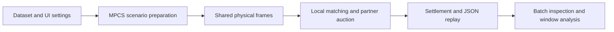

# MAPS: A Multi-Platform Auction-aware Parcel Assignment System for Cooperative Urban Logistics

[English](README.en.md) | [中文](README.md)

MAPS is an interactive demonstration built on the MPCS multi-platform parcel-assignment simulator. A visitor configures a workload, runs the simulator, and follows a target platform's pickup parcels through **workload → parcel → local decision → auction → settlement**. This guide covers the system, research basis, architecture, and audience interactions emphasized by the [VLDB Demonstrations Track](https://vldb.org/2026/call-for-demonstrations.html).

## Research foundation

MAPS draws on the manuscript *Auction-Aware Crowdsourced Parcel Assignment for Cooperative Urban Logistics* by Guanglei Zhu et al. It studies the Cross-Platform Urban Logistics (CPUL) problem: a platform must assign incoming pickups while couriers carry existing dropoffs, and it may use available couriers from cooperating platforms.

| Research component | Method described in the manuscript |
| --- | --- |
| CAPA and CAMA | CAPA processes arriving parcels in batches. CAMA evaluates feasible local courier–parcel pairs using remaining capacity and route detour, applies a dynamic revenue threshold, and sends parcels not assigned locally to the auction pool. |
| DLAM and DAPA | The dual-layer auction first selects a courier within each cooperating platform through a first-price sealed auction, then selects a platform and payment through a reverse Vickrey auction. |
| RL-CAPA | Two learned policies adapt assignment over time: the first chooses a batch duration; the second decides for each parcel whether to defer it to the next batch or send it to the auction pool. The paper studies this adaptive method alongside CAPA using revenue, completion rate, and batch processing time. |

The **RL-CAPA** selection in MAPS runs the current MPCS CAMA/DAPA assignment path at the frame interval chosen in Simulation. Each batch prioritizes higher-revenue parcels and retries feasible couriers when the preferred courier conflicts with another assignment; parcels below the dynamic threshold enter the auction directly. A parcel with no feasible local courier waits for up to six consecutive batches and enters the auction on the sixth failed check. Each partner submits its lowest feasible internal courier bid. The target selects the lowest valid platform bid and pays the smaller of the DAPA second price and its sharing-rate portion of the fare. Inspection displays the wait count, local candidates, internal courier bids, platform bids, winning assignment, and settlement recorded by that run.

## System demonstration



| Module | Visitor actions and visible results |
| --- | --- |
| **Simulation** | Configure a custom run or load a precomputed Chengdu or Shanghai comparison. Custom controls cover dataset and split, arrival window, distinct same-city order dates, pickup/dropoff count or all eligible orders, courier count, service radius, deadline, frame interval, seed, target platform, and algorithms. Watch simulation progress and target-platform results. |
| **Inspection** | Select an algorithm and play or step through batches and the five process stages. Page through large batches to inspect parcel status, local candidates, partner bids, payment, and the target platform's decision archive. Pan and zoom the full processed road network with stations, moving couriers and their routes, unmatched target parcels, and matching links. |
| **Analysis** | Compare target-platform OP, AR, BPT, local/cross assignments, cumulative and per-minute ledger profit, and the target-to-serving-platform flow. Download custom-run replays. |

The selected target platform makes the compared decisions for its own parcels. Comparison runs use the same orders, initial courier fleet, and seed. Platform colors distinguish couriers; the target platform is highlighted. The map shows no region polygons.

## Install and launch

Use Python **3.11 or newer**. From the repository root:

```powershell
python -m pip install -e ".[demo]"
python -m maps_demo.app
```

Open **http://127.0.0.1:8050**. The default `Synthetic` dataset needs no external data. The installed `maps-demo` command is an alternative launch command.

### Guided walkthrough

1. In **Simulation**, keep `Synthetic`, `Test`, target platform `P1`, and seed `11`. Set **Pickup sample** to `Count`, **Pickups per platform** to `10`, **Dropoffs per platform** to `0`, **Couriers per platform** to `2`, and the arrival window to `00:00–00:01`. Select **RL-CAPA** and click **Run simulation**. This configuration produces cross-platform matches.
2. In **Inspection**, use the timeline arrows or **Play** to advance through **Workload**, **Parcel**, **Local decision**, **Auction**, and **Settlement**. Inspect a released parcel's local candidates, partner bids, winner, payment, and courier route.
3. In **Analysis**, read the target platform's assignment and profit measures. The per-minute line shows ledger increments; the cumulative line shows their running total.
4. Return to **Simulation**, choose **Compare algorithms**, select at least two of `RL-CAPA`, `ImpGTA`, `MRA`, `Greedy`, `RamCOM`, and `LocalSum`, and run again. Switch **Displayed algorithm** in Inspection, compare results in Analysis, and use **Download replay JSON** to save the run.

For a prepared city comparison, select **Precomputed preset** under **Scenario source**, choose Chengdu or Shanghai, and click **Load preset replay**. The preset fixes P1 as the target, four platforms, all eligible orders in the arrival window, a 20-second batch interval, and all six algorithms. Chengdu uses 08:00–09:00 and 300 couriers per platform; Shanghai uses 09:00–10:00 and 100 couriers per platform. Both use a 720-second pickup deadline. Inspection and Analysis use the saved process and results without rerunning the simulator.

Changing a control after a run does not update the displayed replay; click **Run simulation** to apply the new settings.

### Real-city data

`Chengdu`, `Shanghai`, and `Shanghai 16` require local processed parcel files and their city road graphs under `dataset/`. Those files are excluded from Git. For Chengdu, put the processed files in `dataset/Didichuxing/Chengdu/parcel_v2/`; [mpcs/arguments.py](mpcs/arguments.py) defines the expected road graph path. Given locally available Chengdu source data, prepare parcel-v2 files with:

```powershell
python -m mpcs.utils.DataUtils `
  --source-root dataset/Didichuxing/Chengdu/dataset `
  --output-root dataset/Didichuxing/Chengdu/parcel_v2 `
  --seed 20250308
```

Generate the fixed city replays after preparing both datasets:

```powershell
python -m maps_demo.presets all
```

The generator saves complete stage, map, auction, ledger, and comparison data under `output/presets/`, one batch chunk at a time. It can resume after a completed algorithm. The generated files are local and excluded from Git; copy them with the project or regenerate them on another machine. Both presets use distinct `Test` order dates for P1–P4.
On Windows, [the experiment script](scripts/run_preset_experiments.ps1) runs the algorithms in sequence and verifies both completed replays. [The progress checker](scripts/check_preset_progress.ps1) can be scheduled every 30 minutes; it writes to `output/presets/monitor.log` and disables its task after verification succeeds.

For a real-city run, choose a distinct order date for every platform from the same city. The availability table counts parsed, deduplicated orders inside the operational area and selected arrival window. Choose a numeric sample or **All eligible** separately for pickups and dropoffs. `Train`, `Validation`, and `Test` are selectable; platform dates supply the files for the selected split. Real-city presets have fixed platform counts; Synthetic supports 2–16 platforms.

## Metrics and replay

| Measure | Meaning in MAPS |
| --- | --- |
| **OP** | Target-platform ledger profit at the arrival-window cutoff, including local, cross-platform, and existing dropoff components. |
| **AR** | Target pickups assigned by the cutoff divided by all sampled target pickups. |
| **BPT** | Mean target decision time per nonempty batch, in milliseconds. It includes policy, local matching, and auction computation, and excludes courier movement. |
| **Profit per minute** | One-minute increments of the target ledger; the increments sum to displayed OP. |

The simulator continues through outstanding pickup deadlines, but Analysis ends at the selected arrival-window boundary. For `10:00–11:00`, charts and summary metrics use frames before `11:00`; later frames remain available in Inspection. A comparison is one matched-seed scenario, so repeat it with other seeds before drawing general performance conclusions.

The most recent custom run is saved to `output/maps-demo/latest.json`. **Load last replay** opens it without rerunning the simulator; **Download replay JSON** exports that run. Fixed presets store a shared road layer and parcel catalog, per-algorithm summaries, and compressed batch chunks under `output/presets/`; Inspection reads only the selected chunk.

## Code and research CLI

| Component | Role |
| --- | --- |
| [maps_demo/app.py](maps_demo/app.py) | Dash controls, progress, playback, and analysis. |
| [maps_demo/engine.py](maps_demo/engine.py) | Scenario setup and recorded batch decisions, snapshots, receipts, and metrics. |
| [maps_demo/presets.py](maps_demo/presets.py) | Fixed scenario generation, chunked replay storage, and loading. |
| [maps_demo/capa.py](maps_demo/capa.py), [maps_demo/ramcom.py](maps_demo/ramcom.py) | Local release and cross-platform method adapters. |
| [maps_demo/geography.py](maps_demo/geography.py), [maps_demo/figures.py](maps_demo/figures.py) | Processed road and station layers, map replay, and charts. |
| [mpcs/core/Framework.py](mpcs/core/Framework.py) | Shared clock, assignment, movement, and settlement. |

The research CLI also provides dataset and algorithm listings, baseline runs, mixed-platform experiments, PPO training, pipelines, and sweeps. For example:

```powershell
python -m mpcs datasets
python -m mpcs algorithms
python -m mpcs run --dataset synthetic --split test `
  --methods localsum mra --output output/synthetic-baselines
```

See the [architecture](docs/architecture.md) and [extension guide](docs/extending.md) for the backend and plugin interfaces.
