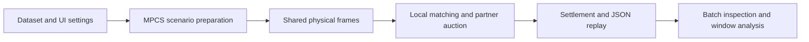

# MAPS: A Multi-Platform Auction-aware Parcel Assignment System for Cooperative Urban Logistics

[English](README.en.md) | [中文](README.md)

MAPS is an interactive system demonstration built on the MPCS multi-platform parcel-assignment simulator. It lets an audience configure a workload, run a real simulation, and follow a **target platform's** pickup parcels through **workload → parcel → local decision → auction → settlement**. The same run connects its batch decisions and road-network replay to its economic results. The [VLDB Demonstrations Track](https://vldb.org/2026/call-for-demonstrations.html) asks for a system's significance, architecture, exact demonstration scenarios, and audience interaction; the guide below describes those elements for MAPS.

## Research basis and system contribution

MAPS is grounded in the Cross-Platform Urban Logistics (CPUL) problem studied in *Auction-Aware Crowdsourced Parcel Assignment for Cooperative Urban Logistics* (Zhu et al.). A platform receives pickup requests while its couriers also have their own delivery work. Local capacity can be insufficient even when another platform has a feasible courier. The research studies how to choose local versus cooperative service and how to pay a cooperating platform and its courier.

The demonstrated system makes three research ideas inspectable in one execution:

1. **Batch assignment on a shared physical clock.** All platforms submit decisions for a frame; the simulator then performs local matching, cross-platform allocation, courier movement, and ledger updates. A batch trace shows the actual target parcels and decisions at each stage.
2. **Adaptive local release and auction.** The current RL-CAPA option uses the reference CAMA revenue threshold to decide which target parcels enter local matching and which are released. For a released parcel, feasible partner platforms submit courier and platform bids; DAPA selects the lowest valid platform bid and applies its payment rule. The trace exposes candidates, bids, the winner, and the settlement receipt.
3. **Controlled algorithm comparison.** The target platform can run RL-CAPA, ImpGTA, MRA, Greedy, RamCOM, or LocalSum on the same sampled orders, initial courier fleet, and random seed. Partner behavior stays fixed: partners match their own work locally and offer remaining feasible capacity to the target. Each algorithm keeps its current MPCS matching and cooperation semantics; comparison results are computed from the run, not loaded from historical experimental tables.

In this demo, **RL-CAPA is a rule-based CAMA/DAPA baseline**. It does not load or train the actor-critic policy discussed in the research manuscript. The project also includes a separate MPCS CLI for experiments and PPO training; the interactive demo runs one configured episode per selected algorithm. See the [current demo design](docs/demo-design/07-MAPS系统演示设计.md) and [target-platform algorithm decision](docs/adr/0001-target-platform-algorithms.md) for the implementation contract.



## What the audience can do

| Module | Interaction | What it reveals |
| --- | --- | --- |
| **Simulation** | Choose a dataset and split, arrival window, platform order dates, pickup/dropoff sample size or all eligible orders, fleet and routing parameters, target platform, algorithm(s), and seed; run or reload a scenario. | Eligible order counts, simulation progress, and a target-platform result summary. |
| **Inspection** | Choose a comparison run and play or step through batch stages. Pan and zoom the map; toggle roads and stations. | A batch table with parcel ID, status, pool action, local match, and cross match; feasible local couriers; partner auction bids and payment; the target platform's decision archive. The map shows the complete processed road network, stations, moving couriers and navigation paths, unmatched target parcels, and assignment links. |
| **Analysis** | Compare algorithms and download the replay. | Target-platform OP, AR, BPT, local/cross assignments, cumulative ledger profit, one-minute ledger changes, and the target-to-serving-platform flow. |

Platform colors identify courier ownership; the selected target platform is highlighted. Partner couriers remain visible because they are potential resources, but the parcel trace and outcome measures concern only the target platform's parcels. The map does not draw region polygons.

## Install and launch

Use Python **3.11 or newer**. From the repository root:

```powershell
python -m pip install -e ".[demo]"
python -m maps_demo.app
```

Open **http://127.0.0.1:8050** in a browser. The default `synthetic` dataset runs without external data or a model checkpoint. The installed `maps-demo` command is an alternative to `python -m maps_demo.app`. The application runs locally through Dash and Plotly; it requires no login or external service.

### A five-minute demonstration

1. In **Simulation**, keep `Synthetic`, `Test`, `P1`, and seed `11`. To make the cross-platform stage visible, set **Pickup sample** to `Count`, **Pickups per platform** to `10`, **Dropoffs per platform** to `0`, **Couriers per platform** to `2`, and the arrival window to `00:00–00:01`. Select **RL-CAPA** and click **Run simulation**. The progress bar reports preparation and simulated frames.
2. Open **Inspection**. Use the timeline arrows or **Play** to advance one frame and stage at a time. Follow a batch from **Workload** and **Parcel** to **Local**, **Auction**, and **Settlement**. The batch table identifies released parcels; the auction section lists eligible partners, submitted bids, the selected platform, and payment. Zoom the road map to inspect courier routes and target parcel positions.
3. Open **Analysis** to read the target platform's assignment and ledger results. The one-minute profit line shows each minute's ledger increment; the cumulative line shows its running total.
4. Return to **Simulation**, change **Run mode** to **Compare algorithms**, select at least two of `RL-CAPA`, `ImpGTA`, `MRA`, `Greedy`, `RamCOM`, and `LocalSum`, then run again. In **Inspection**, switch **Displayed algorithm** to compare batch decisions. In **Analysis**, compare the algorithms' OP, AR, BPT, and profit curves. Use **Download replay JSON** to save the result.

The replay records frames through the last pickup deadline so that requests arriving near the window end can still be inspected. **Analysis stops at the selected arrival-window boundary**: for a `10:00–11:00` window, its metrics and charts use frames before `11:00`, even though later replay frames exist.

Changing a control after a run does not change the displayed replay. Click **Run simulation** again to apply the new settings.

### Real-city data

`Chengdu`, `Shanghai`, and `Shanghai 16` use local processed parcel files and a matching city road graph under `dataset/`. These files are excluded from Git, so a fresh clone can run `Synthetic` immediately and needs locally prepared data for real-city presets. For Chengdu, the expected processed directory is `dataset/Didichuxing/Chengdu/parcel_v2/`; the input road graph path and dataset settings are defined in [mpcs/arguments.py](mpcs/arguments.py). The bundled [DataUtils converter](mpcs/utils/DataUtils.py) can prepare Chengdu parcel-v2 files from locally available source data:

```powershell
python -m mpcs.utils.DataUtils `
  --source-root dataset/Didichuxing/Chengdu/dataset `
  --output-root dataset/Didichuxing/Chengdu/parcel_v2 `
  --seed 20250308
```

For a real-city run, select **one order date per platform from the same city**; dates must be distinct. The availability table counts parsed, deduplicated orders inside the operational area and selected arrival window. Choose a numeric sample or **All eligible** for pickups and dropoffs. `Train`, `Validation`, and `Test` are selectable; the platform date controls determine the actual source files used in the chosen split. Real-city presets use their configured number of platforms, whereas the synthetic preset allows 2–16.

## Metrics and replay

| Measure | Meaning |
| --- | --- |
| **OP** | Target platform ledger profit at the arrival-window cutoff, including the simulator's local, cross-platform, and existing dropoff components. |
| **AR** | Target pickup parcels assigned by the cutoff divided by all sampled target pickup parcels. |
| **BPT** | Mean target decision time per nonempty batch, in milliseconds: target policy, local matching, and auction, excluding courier movement. |
| **Profit per minute** | Difference in the target ledger total during each one-minute interval; its increments sum to displayed OP. |

The most recent computed run is written to `output/maps-demo/latest.json`. **Load last replay** opens that file without rerunning the simulator; **Download replay JSON** exports the current run. A comparison replay stores one shared parcel catalog and road layer with a separate batch trace and summary for each algorithm. Results in the UI are from the selected target platform and selected window, not the aggregate of all cooperating platforms.

## Implementation map

| Component | Role |
| --- | --- |
| [maps_demo/app.py](maps_demo/app.py) | Dash controls, progress, playback, and analysis views. |
| [maps_demo/engine.py](maps_demo/engine.py) | Builds MPCS scenarios and records frame snapshots, batch decisions, receipts, and target metrics. |
| [maps_demo/capa.py](maps_demo/capa.py), [maps_demo/ramcom.py](maps_demo/ramcom.py) | Research-method adapters for local release and cross-platform allocation. |
| [maps_demo/geography.py](maps_demo/geography.py), [maps_demo/figures.py](maps_demo/figures.py) | Processed road/station export, map replay, and result plots. |
| [mpcs/core/Framework.py](mpcs/core/Framework.py) | Shared simulation clock, assignment, movement, and settlement. |

The research CLI remains available after installation. For example, `python -m mpcs datasets` lists presets, and the command below runs a baseline comparison outside the interactive demo:

```powershell
python -m mpcs run --dataset synthetic --split test `
  --methods localsum mra --output output/synthetic-baselines
```

See [the CLI and architecture guide](README.md) for mixed-platform training, plugins, and experiment workflows.

## Scope of the demonstration

The GUI evaluates one sampled episode per algorithm and does not establish a statistical performance ranking or reproduce the research manuscript's historical experiments. The current RL-CAPA option is rule-based, and BPT measures simulator decision computation rather than network communication or end-to-end delivery time. Real-city data are local inputs and are not distributed with this repository.
