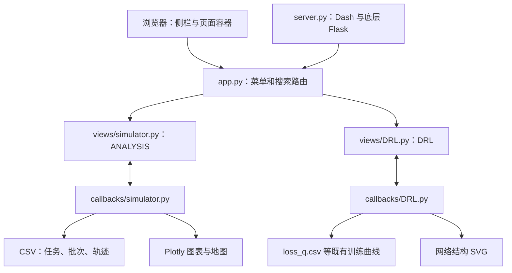
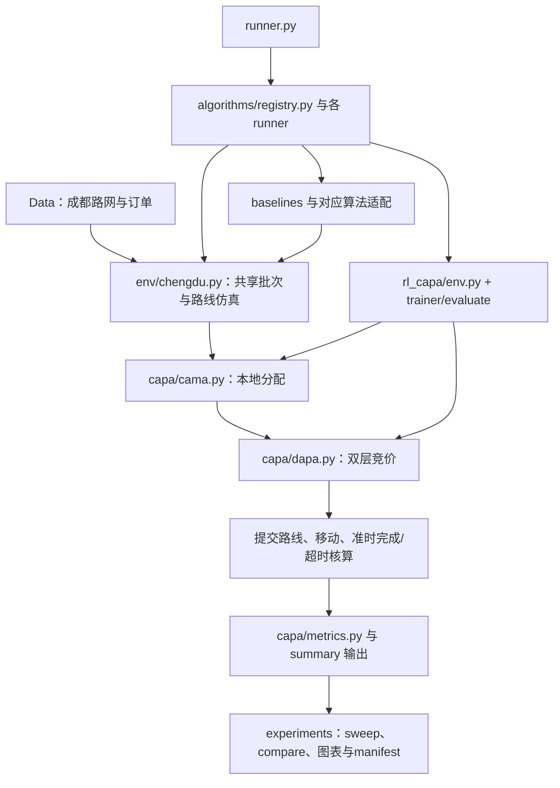

# 01｜现状、参考架构与研究定位

修订：2026-09-21。源码事实沿用2026-09-20审查；展示定位已按用户要求简化为两标签页demo。

## 1. 研究范围与判断方法

本次围绕三个问题展开：AMSAS 的可用交互模式是什么；目标仓库中有哪些可以直接支撑展示的真实算法和成果；什么系统贡献能服务 VLDB demo 的观众，而不仅是展示更漂亮的结果图。

证据分为四类：**源码事实**、**论文表述**、**存档结果**、**拟建设计**。论文写了某功能不代表代码已实现；存在结果文件不代表已核实其数据、配置和复现链路。下文“建议”“应”“计划”均指新系统设计，具体源码证据见审查附件。

code-review 原技能面向固定基点的 Git diff；本任务是现状分析，AMSAS 无 Git 仓库，也未提供变更基点。因此按当前源码开展 Standards（工程可复用性）和 Spec（论文一致性）两条审查，不宣称已做提交差异审查。

## 2. AMSAS 的实际架构

这是一个以 Python Dash 回调驱动的单体展示应用。布局采用 feffery Ant Design 组件，图表与地图主要由 Plotly 构造；`server.py` 暴露底层 Flask server。有效导航只有 ANALYSIS 与 DRL；`results.py` 等文件存在，但不能据此认定结果页已经接入。证据：[app.py](../../app.py)、[server.py](../../server.py)、[完整审查](research/amsas-audit.md)。

### 2.1 它展示什么

| 页面 | 展示内容与交互 | 值得借鉴的设计 |
|---|---|---|
| ANALYSIS | 按时间段、任务状态观察地图；查看任务与 courier；统计卡、状态分布、批次和收益图表 | 同一时间窗口驱动多个视图；从城市整体下钻到对象 |
| DRL | 算法/网络结构选择、训练曲线、迭代回放和网络 SVG | 将运行过程与模型分析分开；允许暂停和逐步理解 |
| 页面导航 | 左侧菜单及简单搜索路由 | 将空间结果和模型诊断分为两个工作区 |

从源码能判断组件组织与交互入口，但本次未成功启动并逐项点击 AMSAS；布局溢出、浏览器兼容、所有控件的运行时行为不属于已验证事实。

### 2.2 Standards：不宜直接继承的工程问题

1. **路径不可移植。** CSV 与网络 SVG 相关路径包含其他 Windows 目录和 macOS 绝对路径，迁移机器会影响读取与输出。
2. **展示、读取、计算混在回调中。** 同一个 UI 交互承担数据访问与图形生成，较难保障多视图指标来自同一运行快照。
3. **共享状态容易残留。** 训练回放采用全局状态，网络图输出文件共享；本demo只做单会话，重点保证重新加载与重置时不沿用旧数据，不增加多用户隔离功能。
4. **依赖与部署说明不足。** 本次未发现可直接依赖的完整应用环境清单。源码可用于理解交互，不能承诺一键启动。

这些是当前工程行为的审查结论，不能外推为 AMSAS 原作者发布系统的全部能力。详见 [AMSAS 审查](research/amsas-audit.md)。

### 2.3 Spec：展示可信性的问题

`callbacks/simulator.py:321` 直接返回固定任务数、收益、处理时间和完成率。因此过滤操作与这些汇总卡可能不一致。DRL 的模拟运行主要切片已有曲线，各算法标签不等同于分别触发真实训练。

新demo的指标来自真实计算或结果文件；已有记录可以播放，但应标记“预计算回放”，不能命名为“实时训练”。

## 3. 论文与目标项目能够支撑什么

用户给定论文：[Auction-Aware Crowdsourced Parcel Assignment for Cooperative Urban Logistics](<../../../auction_aware_task_assignment/docs/Auction-Aware Crowdsourced Parcel Assignment for Cooperative Urban Logistics.md>)。此处相对链接仅作文件引用，算法附件提供绝对路径证据；真实目标目录不在 AMSAS 内。

论文研究 CPUL：本地平台面对在线取件需求，可由本地 courier 服务，或利用合作平台的 courier；已有送件任务形成路线与容量约束。目标是本地平台的净收益，不是无条件最大化跨平台量，也不是自动实现全联盟收益最优。

| 机制 | 可讲清的问题 | 建议展示 |
|---|---|---|
| 数据与路线约束 | 为什么看似很近的 courier 仍不可选 | 地图、已有路线、容量、截止时间、排除原因 |
| 时间批次 | 等待更多任务可能提高匹配质量，但增加延迟 | 批次边界、到达强度、等待时长与过期风险 |
| CAMA | 本地候选如何筛选与匹配 | 候选图、效用/净收益、阈值、被选和被拒的依据 |
| DAPA/DLAM | 谁在两层竞价中获胜，实际付了多少钱 | courier 竞价 → 平台报价 → 分支对应的支付 → 收益分解；次低价限至少两个有效平台且非 λ 模式 |
| RL-CAPA | 批次窗口和包裹去向如何共同影响结果 | 两阶段策略概率、实际动作、后续反馈 |
| 实验与消融 | 改进来自什么，何时无优势 | 同场景对照、多个 seeds、失败案例与开销 |

仓库包含 CAPA 模块、RL 环境与训练器、统一 runner、对照实验及结果文件，足以作为算法引擎候选。接入demo只需补充演示任务的必要过程记录，并统一整理为可绘制的数据；不需要将它改造成事件服务或版本管理系统。[算法审查](research/algorithm-evidence.md)、[成果审查](research/results-audit.md)

当前项目实际调用关系如下；接入时应保留共享仿真中的路线推进和完成核算，不能只调用较简化的 `capa/runner.py` 然后认为结果口径相同。

## 4. 展示选定方法时需注意的事实差异

| 问题 | 当前依据 | 对设计和论述的影响 |
|---|---|---|
| 旧规范仍写 DDQN，最新论文已写双 actor/critic | `AGENTS.md` / `docs/agent.md` 与论文 III-D | UI 以当前运行的模型元数据为准，不能硬画 DDQN |
| 论文 CAMA 的效用阈值/KM 与当前逐包裹选择实现不同 | 论文 Algorithm 2；`capa/cama.py` | 当前实现不能展示虚构的 KM 增广过程；先决定论文对齐或明确变体 |
| Stage-2 的 0 动作语义不同 | 论文写 defer；当前环境先本地匹配，失败可同批级联 DAPA | 这是不同的决策语义，不能把该动作显示为“直接延期” |
| 未来包裹数量直接统计未来输入 | `rl_capa/env.py:610` 等；courier 的 available_from 还需区分是否为已知排程 | 逐字段标 oracle/forecast/known_schedule；oracle 结果不进入在线方法总排名 |
| 模型训练结构、优化器和论文参数有差异 | trainer 实际为 2 actor + 3 critic、5 个 Adam 优化器；优势函数与论文也不同 | 核验实际网络、优化器、目标和 checkpoint，不照抄四网络论文图 |
| 部分曲线来源为 estimated / postprocessed | 部分 result manifest、README 实验说明 | 不纳入默认实测排行榜，不用于无说明的速度/收益主张 |
| 多 seed 均值与最后 seed 回放混放 | `rl_capa/evaluate.py` | 用图注明确单次/均值；地图绑定单次结果，不增加aggregate管理模块 |
| BPT 计时边界与端到端延迟不同 | `capa/metrics.py` 和 timing 实现 | 同时报告历史 BPT 与完整算法 wall time，不直接相加嵌套计时 |

这些差异不是“算法无效”的证明，而是对“该版本忠实复现论文”和“图表支持该结论”的证据限制。选定演示版本时应核对这些差异，用准确图注和必要记录说明；无需先解决全部历史实验问题才能开始页面开发。

## 5. 轻量 Demo 的定位

本次只做两个标签页，让观众看清同一件包裹从本地匹配、双层竞价到RL选择与完成结果的过程。保留少量真实过程记录和图表即可，不建设通用数据管理或实验分析平台。

- **过程演示**：加载数据、选择算法/模型、播放过程、点击包裹看候选和报价；RL模式额外显示两阶段动作。
- **结果图表**：展示当前结果；可选读取已有对比和训练曲线。

使用一个Dash应用直接调用Python算法；回放文件采用简单JSON/CSV。已有审查是避免错误展示的依据，不要求把每项审查都做成平台功能。未用到的实验、历史数据、算法变体可留在原项目，本次只接入选定演示所需内容。

### 与相关工作的关系

AMRAS（PVLDB 2022）已有分配、时间窗口与决策模型可视化。本demo重点放在跨平台包裹的双层竞价及两阶段策略如何影响具体分配；不把更多菜单或通用平台能力当作贡献。AMRAS论文与本地AMSAS的源码关系未核实。[原文](https://www.vldb.org/pvldb/vol15/p3690-li.pdf)

GTA已提出平台联盟和相关拍卖机制，比较时应说明目标收益、courier激励及基线适配差异。此类论文比较不要求新增管理页面。[原文](https://ieeexplore.ieee.org/document/10057995/)

当前设计只主张通过交互讲清算法，没有声称新颖性或性能已经被验证。具体实现范围见[轻量需求](02-需求与验收.md)。
