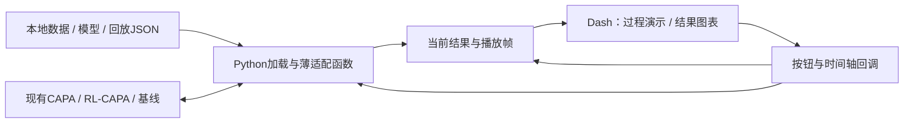

# 03｜最简技术实现

修订：2026-09-21。本文件是轻量demo的实现建议，替代上一版前后端分离、数据库与事件服务设计。

## 1. 推荐栈

**Python + Dash + Plotly + 少量CSS；算法继续使用原项目，RL推理继续使用已有PyTorch模型。**

AMSAS已有Dash页面与回调的参考，目标算法也是Python。为两个展示标签页引入React、FastAPI、DuckDB、Redis等独立组件没有必要。建议新写一个小型demo目录，借鉴布局，避免直接继承AMSAS的硬编码指标和失效路径。

Dash回调可将按钮、下拉框和滑条连接到图表；`dcc.Interval`可定时推进播放索引。这足以支撑当前设计的离散步骤回放。[Dash回调](https://dash.plotly.com/basic-callbacks)、[Interval组件](https://dash.plotly.com/dash-core-components/interval)

先用Plotly画路网线、任务点和courier；如果现有数据只有节点坐标，也能形成干净的空间视图。底图不是必需项，有需要再加；没有路网几何时将连线标为任务关联线，不冒充实际行驶路线。两层竞价以表格、条形图和简单连接结构展示。

## 2. 架构只有三部分



这是一个本地应用，不拆服务。不设计用户表、运行数据库、REST接口目录、SSE推送、消息队列和任务管理器。

## 3. 建议目录

```text
capa_demo/
  app.py               # 两个标签页、控件、回调
  adapter.py           # 加载数据/模型、调用原算法、整理结果
  figures.py           # 地图、竞价、曲线绘制
  playback.py          # 帧索引、单步、进度控制
  assets/style.css     # 统一字体、颜色、留白
  examples/            # 小场景、回放、对比和训练日志
  demo_config.json     # 算法项目路径、示例路径
  requirements.txt
```

先以这些文件完成闭环，不预设大目录或插件机制。路径使用配置和相对路径，避免写死开发者机器目录。一个启动命令打开一个本地网页，不需要Node构建、容器编排或数据库初始化。

## 4. 直接复用算法

适配层连接现有`algorithms`入口、`env/chengdu.py`、`capa`与`rl_capa`。保留原环境的路线推进、准时完成和收益核算，不在UI回调中重新写竞价或匹配算法。具体入口参考[算法审查](research/algorithm-evidence.md)。

只需要以下几类Python函数；名称是建议，不是新增Web API：

| 函数职责 | 最小输入 | 最小输出 |
|---|---|---|
| load_data | 受支持的数据路径和抽样参数 | 场景对象、显示信息 |
| load_model | 模型目录、算法配置 | 模型、normalizer、特征与动作说明 |
| run_demo | 场景、算法名、可选模型、参数 | 过程帧、指标、图表数据 |
| load_replay | 本地回放文件路径 | 同样的过程帧、指标、图表数据 |
| build_figures | 当前结果、帧号、选中任务 | 地图、详情、统计图 |

“加载模型”指加载项目已有RL-CAPA结构对应的权重及配套信息，不支持任意网络文件。检查特征顺序/维度、动作集合和normalizer是否兼容；普通算法直接运行，不要求模型。

每次重新计算从干净的场景初态开始，不复用上一次已改变的路线、阈值历史或随机状态。计算期间锁定数据/模型选择；修改配置后清除旧结果或明确标记待重算。

## 5. 最少保存什么

不必实现通用事件溯源。给demo生成一个**回放文件**即可，包含基本说明、按顺序排列的显示帧和结果：

```text
replay.json
  meta
    数据名、实际数据来源、算法/实现版本
    模型名（如有）、本次参数、seed、来源文件
    指标单位、实测/估算说明、oracle说明（如适用）
  frames[]
    step_index、sim_time_s、batch_id、stage
    当前任务/courier位置与状态、需要的路线
    累计收益、准时完成数、当前批长
    details：该阶段或预选任务需要的说明
  summary
    最终TR、CR、BPT及已完成/未完成数量
  charts
    按时间/批次的收益、数量、批长等数组
```

同一时间可有多个算法步骤，用`step_index`保持顺序。地图只需按批次或阶段更新，不必模拟每毫秒移动。小场景优先保存可直接绘制的帧，时间轴拖动直接索引；不需要状态重建数据库或可继续计算的环境checkpoint。

具体形状可用简单dict/list或dataclass，不先开发庞大的schema框架。CSV存图表序列，JSON存嵌套过程；只支持实际用到的几种格式。大数据先在原实验脚本中抽样/整理，不让浏览器一次加载全量轨迹。

### 算法过程的最小补充记录

| 阶段 | demo需要的字段 |
|---|---|
| 分批 | 批次起止、任务数、选中批长 |
| 本地匹配 | 预选包裹ID、候选courier、可行性/拒绝原因、真实分数/阈值、匹配结果 |
| courier竞价 | 包裹、平台、代表courier及实际BF报价 |
| 平台竞价 | 有效报价、胜者、次低价证据、实付及使用的单/多投标者规则 |
| RL决策 | 批长动作、任务动作概率、选中动作、实际本地/跨平台/延期结果 |
| 完成核算 | 任务ID、准时与否、本次确认收益 |

只对演示任务详细记录，其他任务可保留位置、状态和汇总。不得仅凭旧summary重建不存在的候选或报价。当前decision_trace不足时，给原计算加少量只读记录，再用同一输入检查结果不变。

记录时复制数值，不保存会继续变化的courier引用，不额外调用采样/推理改变结果。完整候选日志、跨阶段因果索引、所有报价的审计覆盖度都不属于首版要求。

## 6. 计算和播放分开

### 默认流程

1. 点“开始运行”：读取当前控件，运行一个小场景；显示计算中并禁止重复点击。
2. 运行结束：得到完整结果和帧数组，进入可播放状态。
3. Interval推进`frame_index`，地图和详情读取同一帧；暂停关闭Interval。
4. 单步增加一个索引，重置回到第0帧，拖动直接定位；倍速只改播放节奏。
5. 点“加载回放”直接从第2步开始，标记“预计算回放”。

这满足动态展示过程，不宣称是在观察正在执行的算法。复杂的边计算边推送不是首版必要条件。

### 只有实际需要时再加计算子进程

若小场景计算时间仍影响浏览器可用性，可由一个本地子进程执行，主页面短间隔检查完成状态。一次只跑一个，结果写入唯一临时目录；正常退出、异常退出和关闭应用时清理该进程。没有排队、调度、持久化恢复和运行列表。

不在每次Interval刷新时重新加载模型或执行算法。播放回调只读已产生的显示数据。

## 7. 少量页面状态

仅保存：已加载数据、所选算法/模型、计算状态、当前结果引用、帧索引、播放开关、倍速、选中包裹。

数据和模型放Python端，浏览器只保存轻量索引/选择信息。当前设计仅供单机单演示会话，计算互斥；不支持多人同时运行。回调集中更新播放状态，避免计时器与手动拖动分别覆盖索引。对比图通过另行加载的结果数组生成，不建立实验管理数据库。

## 8. 最小校验与交付

- 加载检查：必需字段、坐标/单位、兼容模型；不支持的格式直接说明。
- 结果检查：选定示例的TR/CR/BPT和原项目输出一致；单步和最终帧状态一致。
- 过程检查：至少一件包裹的候选、竞价、实付与算法记录相符。
- 交付：demo代码、依赖清单、一个小数据示例、兼容模型、一个过程回放和启动说明。

算法修订、训练和大规模论文实验继续在原项目完成；demo负责加载与展示，不承接科研流水线。依赖版本在实现时实际验证并锁定；本次不安装应用依赖或实现页面。
