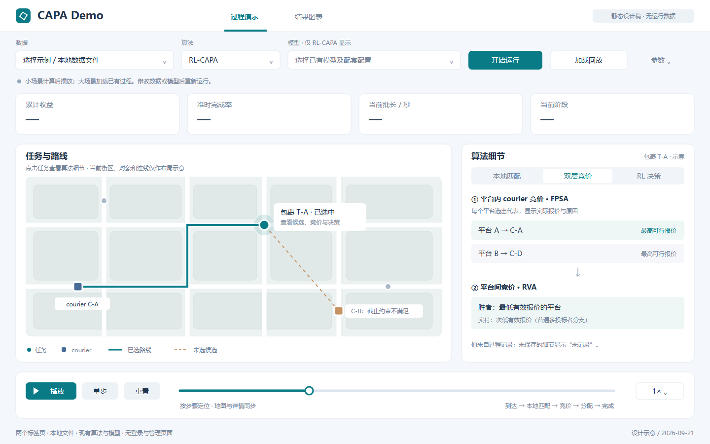

# 04｜两个标签页的展示设计

修订：2026-09-21。以少页面、少按钮、清晰展示算法为准，替代原五工作区设计。

## 1. 整体布局

取消侧边栏、用户头像、首页门户和管理入口。顶部只有名称及两个标签：**过程演示｜结果图表**。下面一行加载/运行控件，主体留给地图、算法细节和图表。

```text
┌ CAPA Demo ─────── 过程演示 | 结果图表 ─────────────────────┐
│ 数据 [选择]   算法 [CAPA ▾]   模型 [仅RL显示]              │
│ [开始运行] [加载回放]                         参数 ▾       │
├───────────────────────────────────────────────────────────┤
│ 累计收益        准时完成        当前批长         当前阶段    │
├─────────────────────────────────┬─────────────────────────┤
│                                 │ 选中包裹 / 当前批次     │
│        地图或路网图             │ 本地匹配 | 竞价 | RL    │
│  任务、courier、平台与路线       │ 候选、原因、报价与动作  │
│                                 │                         │
├─────────────────────────────────┴─────────────────────────┤
│ [播放/暂停] [单步] [重置]    进度滑条          倍速 ▾     │
└───────────────────────────────────────────────────────────┘
```

默认只展开必需控件。选择RL-CAPA才出现模型选择和RL详情；参数区只保留与演示相关的任务数、固定批长等，其他参数沿用已核验配置。

## 2. 页1：过程演示

### 加载和运行

| 控件 | 行为 |
|---|---|
| 数据选择 | 选内置示例或受支持的本地数据；加载后显示名称与规模 |
| 算法选择 | CAPA、RL-CAPA和实际已接入的基线；不显示尚未实现的方法 |
| 模型选择 | RL模式选择本地兼容模型；文件不兼容直接提示 |
| 开始运行 | 用当前选择计算；完成后准备播放，不覆盖成后台任务列表 |
| 加载回放 | 打开已有过程记录；顶部出现“预计算回放”文字 |
| 参数折叠区 | 少量可调项，修改后提示需重新运行 |

本地数据/模型可用示例下拉和“选择文件/路径”输入，无需文件管理器、数据目录管理或模型注册页面。加载完成的名称显示在控件旁即可。

### 地图

任务用圆点，courier用箭头或方块，平台/站点用不同轮廓。待处理、已分配、准时完成、过期用简洁颜色和图例区分。本地与跨平台用标签或连线样式区分，避免十几种颜色堆叠。

默认只显示当前批次/时间的必要对象；选中任务后才展开相关候选与路线。鼠标点任务，右侧同步出现细节；点空白取消选择。既有送件路线用浅色表示，新的插入任务用强调色表示。

有真实路网几何就画路线，没有就画明确标注的关联线。位置只有批次采样时按离散帧更新即可，不要求连续车辆动画。

### 详情栏内切换

| 视图 | 内容 | 简化方式 |
|---|---|---|
| 本地匹配 | 候选、拒绝原因、实际分数/阈值、最后选择 | 小表格+选中候选的地图高亮，无需复杂大图布局 |
| 双层竞价 | 各平台代表courier及报价→平台报价排序→胜者和支付 | 两块纵向卡片加箭头；先FPSA后RVA |
| RL决策 | 当前批长概率/动作；所选任务跨平台概率、动作和最终路径 | 两张小条形图或数值行，无需神经网络编辑器 |

所选算法没有某阶段就隐藏该详情。某个历史回放没有保存该阶段，则显示“未记录”，不补假数据。

普通多投标者RVA图中区别“最低报价获胜”和“按次低有效报价支付”；单投标者按对应规则显示，不能画不存在的第二报价。RL动作与最终执行方式分开，例如“本地优先 → 本地失败 → 跨平台成交”。

### 播放控制

- 一个按钮在播放/暂停之间切换。
- “单步”前进一个记录的算法阶段；“重置”回到开头。
- 滑条定位记录步骤，并显示模拟时间/批次；倍速用0.5×、1×、2×即可。
- 暂停只停动画；拖动、单步不重新执行算法。

过程页指标取当前帧：累计TR、准时完成数/率、当前批长。BPT等最终统计放到结果页，避免尚在播放时把最终成绩当成当前成绩。

## 3. 页2：结果图表

```text
┌ CAPA Demo ─────── 过程演示 | 结果图表 ─────────────────────┐
│ 当前数据 / 算法 / 模型 / 实测或回放说明                   │
│ 总收益TR          准时完成率CR        平均BPT              │
├──────────────────────────┬────────────────────────────────┤
│ 累计收益曲线             │ 完成 / 未完成 / 过期统计      │
├──────────────────────────┼────────────────────────────────┤
│ 每批任务/分配数量        │ 批长变化或RL动作分布          │
├──────────────────────────┴────────────────────────────────┤
│ 可选：[加载对比/训练结果]     [保存当前图]                 │
└───────────────────────────────────────────────────────────┘
```

不要把所有图挤进首屏；训练曲线或对比图作为下方折叠区展开。只需要已有文件读取和绘图，不增加实验列表、自动训练、模型版本管理等功能。

对比图共用单位与坐标尺度，注明单次结果或多次均值；训练图注明episode/step，保留原始曲线，平滑为可选。算法结果没有某字段时省略该图或给出简短说明。

## 4. 美观来自排版而非页面数量

- 浅灰背景`#F4F7FB`、白卡片、深蓝文字；主要按钮使用蓝色或青色。
- 主区域地图约占2/3，详情约占1/3；16–24 px留白，圆角8–12 px。
- 字体使用本机中文无衬线字体，正文14–16 px；指标只保留必要的3–4项。
- 颜色有固定含义并配文字/形状，不靠高饱和色或闪烁制造“科技感”。
- 首先适配演示笔记本与投影；屏幕较窄时详情移到地图下面，不开发独立移动端。

## 5. 最小提示

页面只需“未加载、计算中、可播放、播放中、失败”等状态文字。文件错误用一句话说明；无候选/无完成任务正常展示，不弹复杂对话框。简短来源说明放在文件名旁或图注里，不做证据管理页面。

## 6. 精简设计稿

[打开PNG](assets/interface-concept.png) · [SVG原稿](assets/interface-concept.svg)



这是布局示意，地图和对象为示意，指标留空；不是已实现界面或实测结果。
