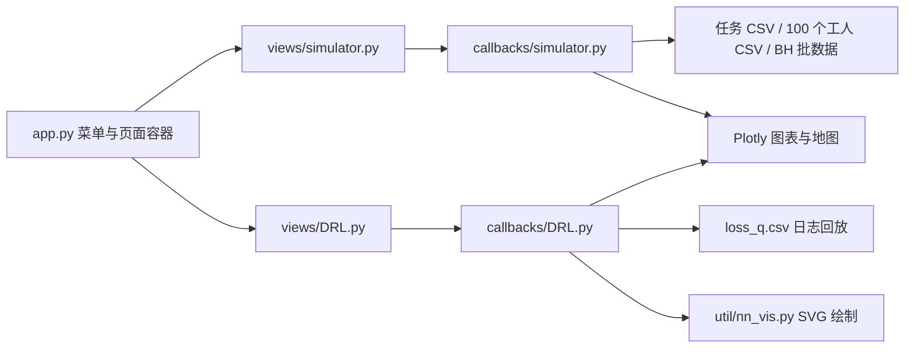

# AMSAS 源码架构与展示审计

> 历史审查（2026-09-20）。源码发现保留；文中的扩展建议不作为当前demo需求。2026-09-21起实施范围以[轻量需求](../02-需求与验收.md)为准。

审计日期：2026-09-20。对象：`D:\Code\AMSAS` 当前目录快照。方法：只读源码、CSV 元数据检查，以及从 AST 提取纯函数后的隔离验证；未启动服务、未安装依赖、未改动业务源码。目录内未发现适用的 AGENTS.md、项目依赖清单、正式需求规格或可用 Git 基线，因此这不是某次提交的 diff 审查，也不推断历史版本的行为。当前 Python 环境缺少 Dash，且存在失效绝对路径；下面的页面描述来自布局与回调源码，不是浏览器实测截图。

## 1. 实际架构

AMSAS 是 Python 单体可视化原型。`server.py:4` 创建 Dash 应用并暴露 Flask server；`app.py:7`、`:8` 导入 ANALYSIS 和 DRL 两页，菜单/搜索通过 `render_page_content` 切换 `page-content`，没有独立前端路由、算法服务或任务队列。UI 混用 Dash HTML/DCC、feffery Ant Design Components、dash-bootstrap-components；图形由 Plotly 生成，地图使用 Mapbox。

`views` 以通配导入加载 `callbacks`，回调模块导入时就读取全部 CSV，计算、数据访问和图形构造集中在长文件中。页面没有统一的 experiment/run 身份、算法配置记录、事件流、结果版本或数据来源清单。

需区分目录存在与运行启用：`models/order.py:5` 是 MySQL/Peewee 的历史订单模型，`callbacks/order.py:10` 会查询全部订单，但当前入口没有加载此页；`views/results.py` 和 `callbacks/results.py` 是棒球统计相关页面，入口已注释。不能把这些文件描述为当前系统正在使用的数据库后端或实验比较模块。

## 2. 用户实际能看到什么

**ANALYSIS：时空任务结果看板。** 左侧是时间范围滑条、All/Online/Offline 筛选、五类任务状态和总体环形图；右侧四张指标卡显示完成任务数、平台总收益、批处理时间、任务完成率，下面用散点与柱形双轴图展示批大小及批收益；下方展示任务地图、单工人容量/收益曲线、单工人任务环形图。布局证据：`views/simulator.py:28`、`:45`、`:67`、`:82`、`:108`、`:136`、`:155`。

交互路径是“刷选批时间图 → 时间滑条 → 状态/地图/统计重算”和“悬停任务点 → 读取 worker_id → 工人详情”。对应 `callbacks/simulator.py:216`、`:354`、`:520`。筛选的时间语义并不是全系统当前存量：`:141` 先取该区间内出现的任务，再按区间结束时间推断状态；因此它是一个任务到达 cohort 的结果视图，应明确标注。

**DRL：训练日志播放及网络示意。** 可以选择 DQN、Dueling DQN、PPO、DPPO、A3C、DDPG，选择三种卷积/池化/全连接组合，选择更新速度；Start/Suspend/Restore 控制动画。曲线包括 loss、Q-target、Q-eval，支持平滑及重叠/分开展示；网络参数、颜色和边距可编辑，生成 SVG 结构图。证据：`views/DRL.py:29`、`:65`、`:83`、`:111`，`callbacks/DRL.py:331`、`:527`。这是界面提供的选择范围，不能据此认定六种算法已实现。

## 3. 真实计算、回放和占位的边界

| 展示内容 | 当前实现 | 证据 |
|---|---|---|
| 任务状态、地图、环形图 | 对已存在 CSV 做过滤与聚合 | `callbacks/simulator.py:133`、`:362` |
| 四个核心指标 | 固定返回 10976、133018.81、1436.28、86.75%，不随筛选更新 | `callbacks/simulator.py:321` |
| 批收益/批大小 | 读 BH.csv，切换其他算法需要改源码注释及标题 | `callbacks/simulator.py:45`、`:682` |
| DRL 动态曲线 | 125 ms 计时器推进步数，从同一个 loss_q.csv 截取前缀 | `views/DRL.py:18`；`callbacks/DRL.py:106` |
| 算法与网络选择 | 对曲线数据源没有作用：始终 `run_logs=data_df` | `callbacks/DRL.py:120` |
| 网络结构修改 | 修改全局绘图配置并写 SVG；没有训练、推理或权重更新 | `callbacks/DRL.py:543`、`:561` |
| 任务数据准备脚本 | 含随机生成任务状态、匹配时间、价格及工人 ID 的逻辑 | `util/pre_data.py:83`、`:95`、`:108` |

现有 CSV 是否都来自该随机脚本，不能仅凭脚本存在确认；同样，BH.csv 和 loss_q.csv 的实验真实性/论文对应关系没有元数据可验证。确定的是当前页面没有调用匹配求解器或 DRL 训练器。任务 CSV 共 20,088 行，工人文件 100 份，BH 批数据 180 行，loss_q 日志 808 行。

## 4. Standards：工程实现问题

未找到正式工程规范，以下是具体可靠性问题和架构判断，不称为违反仓库标准。

1. **P1：启动路径不可迁移。** `callbacks/simulator.py:49` 写死 `D:\runningCode\AMSAS\data\MyView\BH.csv`，本机该路径不存在；实际文件在当前项目 data/MyView。导入阶段会直接失败。`callbacks/DRL.py:569` 和 `util/nn_vis.py:458` 又分别以原作者 macOS 目录检查、写入 SVG。
2. **P1：空结果回调类型错误。** 声明五个输出的 `update_text_pie` 在没有选中任务时只返回字符串（`:264`），而正常分支返回五元组。隔离执行得到 `'0 %'`，不符合回调输出契约。
3. **P2：边界与空选择没有保护。** `filter_task_type` 对匹配、完成和过期时间采用严格大于/小于（`:148–168`）；构造 matching_time 恰好等于窗口终点的任务，五类计数之和为零。`:222` 对空刷选直接 min/max，隔离执行触发 ValueError。
4. **P2：工人负载曲线可能为负。** `pre_worker_task` 从零开始累计（`:452`），没有恢复窗口开始前的在途任务，并漏掉部分同分钟加入/结束事件。用 30 秒匹配、90 秒完成的任务查看 [60,120]，得到容量 -1。应按状态快照初始化并按事件顺序积分。
5. **P2：会话隔离薄弱。** 网络编辑修改全局 config（`callbacks/DRL.py:543`），地图回调修改共享 layout（`callbacks/simulator.py:432`）；多访客演示应改为运行/会话私有状态。

另有重复组件 ID `task_text`（`views/simulator.py:89/102/115/127`）、指向已注释组件 `output-clientside` 的回调（`callbacks/simulator.py:201`）、硬编码访问配置，以及大块无关示例与遗留资源。它们增加部署和维护成本；未执行完整 UI，不能声称所有问题在特定 Dash 版本下必然同时报错。

## 5. Spec：展示语义与目标能力差距

没有原始需求文件，因此不能断言“违反 AMSAS 原设计”。以当前控件标签及用户的新系统目标衡量，有三项确定的不一致：四个指标已被常量替代；算法选择未改变曲线来源；任务滑条和 BH 数据不处于同一日期。任务时间为 1451606400–1451620800，而 BH 是 1477965600–1477969180；时间范围刷选与地图过滤无法构成同一实验的联动。证据为 `views/simulator.py:30`、`callbacks/simulator.py:716` 与 CSV 实测范围。

此外，Online 的注释是新任务/已匹配，实际返回 `[0,1,2]`，包含 Completed；Offline 实际仅包含两个 Expired 状态（`callbacks/simulator.py:207`）。展示口径应由领域状态机统一定义，而非由颜色或页面名称推断。

## 6. 新系统宜借鉴和应重建的部分

值得保留的是“总体指标 → 时间窗口 → 空间分布 → 单实体详情”的观察层次，以及刷选、悬停联动、动画暂停、网络/算法结构解释。推荐重建为“场景配置 → 可行候选 → 算法阶段与决策证据 → 分配结果 → 对照实验”的完整链路：任何图表都能回到同一个 run_id、数据集版本、随机种子和事件。

美观升级应服务于算法解释：用稳定网格布局和统一色彩语义替代混合列宽；把任务、工人、候选边和选中边联动；提供单步/断点/回看、不可行原因、竞争冲突及方案差异。结果卡点击后显示指标公式、分子分母和原始记录。训练曲线只有在目标论文确有训练模块时才保留。

演示可以提供预计算回放，但必须显示 Replay 标识和来源；参数修改后应触发真实计算，或明确提示该结果对应原配置。将研究算法封装为可运行适配器，把可视化追踪作为附加输出，避免从汇总 CSV 反向编造算法内部过程。AMSAS适合作为交互参考，不适合作为新投稿系统的计算事实来源或直接扩建底座。

## 7. 证据与验证范围

上述路径均相对 `D:\Code\AMSAS`。关键绝对位置：

- [入口与页面组合](D:/Code/AMSAS/app.py:7)
- [任务/工人数据加载](D:/Code/AMSAS/callbacks/simulator.py:30)
- [固定指标返回](D:/Code/AMSAS/callbacks/simulator.py:321)
- [训练日志回放](D:/Code/AMSAS/callbacks/DRL.py:106)
- [SVG 绝对路径](D:/Code/AMSAS/util/nn_vis.py:458)

执行的四项隔离验证只调用 AST 提取的纯函数；没有导入应用、连接数据库或运行预处理脚本。缺少 Git 基线和正式规格，Standards/Spec 均为当前快照证据审计，不给出虚构 diff、测试覆盖率、性能指标或论文提升幅度。
